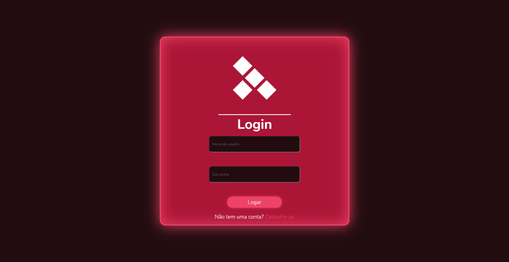
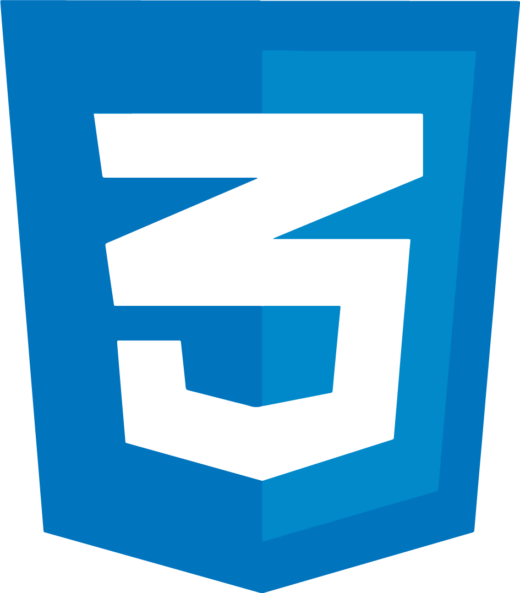
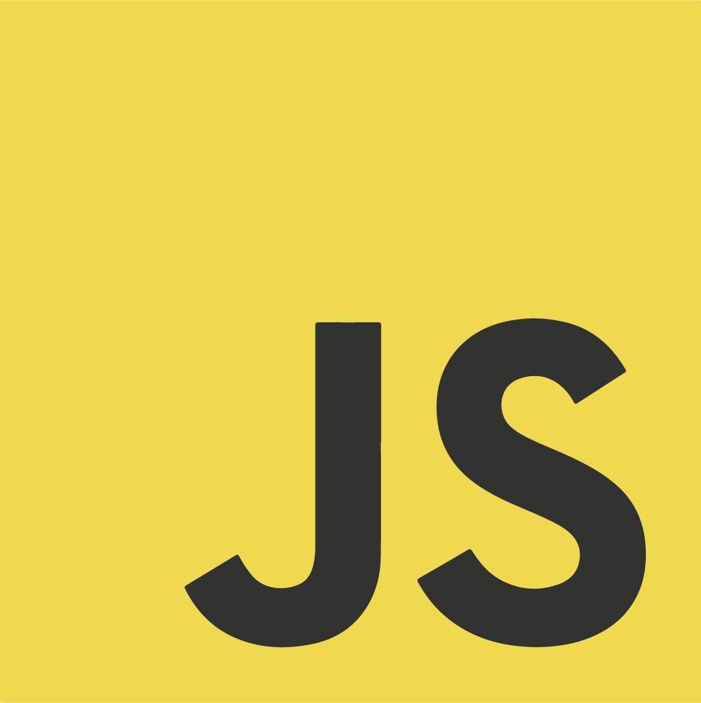
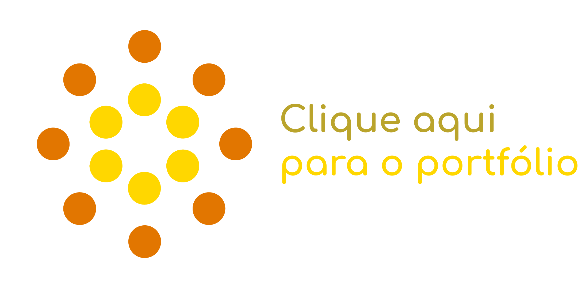

# Formulário Dark

> Um simples formulário dark que não possui Back-End

## 💻 Tecnlogias e Habilidades Usadas no Projeto

## 🚀 Link para o Site

O projeto está hospedado com o hospedagem gratuita do github
<a href="https://dyegoanjos.github.io/Formulario-Dark/" target="_blank" style="background-color: black;">Clique aqui</a>

## 😄 Confira esses e outros projetos no meu portfólio

## 📫 Redes sociais
- <a href="https://github.com/DyegoAnjos" target="_blank">GitHub</a>
- <a href="https://www.linkedin.com/in/dyego-cordeiro-8491891a3/" target="_blank">Linkedin</a>